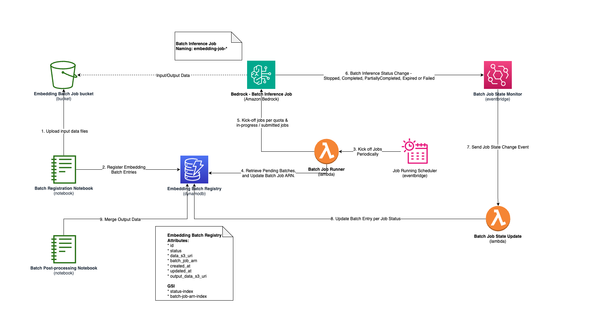

# Batch Processing Large Dataset using Amazon Bedrock

> **Assumption**: the solution assummes that you have some understanding of using [AWS CDK](https://docs.aws.amazon.com/cdk/v2/guide/home.html), and you have an AWS account with the necessary permissions to create the resources. 

Hold tight! We are talking about processing inference results for a large dataset using [Amazon Bedrock Batch Inference](https://docs.aws.amazon.com/bedrock/latest/userguide/batch-inference.html). How large? In our sample use case, we are processing embeding results for 100M records (each with 150-250 tokens) using [Amazon Titan Text Embedding V2]([text](https://docs.aws.amazon.com/bedrock/latest/userguide/titan-embedding-models.html)). 

> **Note**: You may have different size of dataset, and may have different inferencing needs, rather than embedding, you may want to get inference results from other leading LLM models in Amazon Bedrock. 

## The problem

You are tasked to get embedding for a large number of text data set, e.g. 300M records with which 150 - 250 tokens per record. While you are finding [Amazon Titan Text Embedding V2]([text](https://docs.aws.amazon.com/bedrock/latest/userguide/titan-embedding-models.html)) foundation model is so useful, you are facing challenges to speed up the inferencing results, and they are:
* If using on-demand invocation, there is hard limit to do 2,000 requests per minute.
  * If using Provisioned Throughput, the cost can be high, and it's not supported for the foundation model(s) (aka. FM), e.g. [Amazon Titan Embedding Text V2](https://docs.aws.amazon.com/bedrock/latest/userguide/titan-embedding-models.html) is not supported.
* If using batch inference with [Amazon Bedrock Batch Inference](https://docs.aws.amazon.com/bedrock/latest/userguide/batch-inference.html), the cost is lower (50% of on-demand invocation), however, you will have to orchestrate the batch jobs, e.g. there are soft limits (50,000 processing records per batch job, and 20 submitted or in-progress jobs per region), with which may need you to process the dataset in multiple batches. In addition, please note that Bedrock Batch Inference job execution is backed by resource availability and the requested FMs, hence, there may be chance that jobs under 'Scheduled' status for a long time.

## The solution

We will be choosing the batch inference option. The assumption is backed by the speed of batch inference processing is acceptable to our use case, and we don't need to worry about rate limiting of invoking the foundation model in Amazon Bedrock. 

In the solution, we are using serverless architecture (with AWS Lambda, EventBridge Event and DynamoDB) to orchestrate the batch inference jobs. 

There are 4 main stages in the solution:

Stage #1. **Data Preparation**
  > We will generate synthetic data for the sample use case.

  * Jupyter Notebook to prepare the batch registry records and upload related data input files to S3. For more details on data format, please refer to [Format and upload your batch inference data](https://docs.aws.amazon.com/bedrock/latest/userguide/batch-inference-data.html).
  * When adding batch registry records into DynamoDB table, we will be putting the id, status (with Pending), created_at, and data_s3_uri (for the S3 input data uri) into the record.
  * there are two main steps included in the stage: 
    * Upload input data files
    * Register Embedding Batch Entries.

Stage #2. **Running Batch Inference Jobs**
  * Use EventBridge Scheduler to trigger a Lambda function 'Batch Job Runner' to
    * Retrieving 'Pending' batches, and compare the max number of submitted jobs limit with the current number of submitted / in-progress jobs, then decide the amount of jobs to be submitted, while updating the related batch registry records with 'SUBMITTED' status.
  * There are 3 main steps included in the stage:
    * Kick off Jobs periodically.
    * Retrieve Pending batches, and update batch Job ARN
    * Kick off jobs per quota & in-progress / submitted jobs.

Stage #3. **Updating Batch Inference Job Result**
  * When a batch inference job is completed, the Lambda function 'Batch Job State Update' will be triggered per EventBridge rule with 'Batch Job State Monitor'. 
  * There are 3 main steps included in the stage:
    * Batch Inference Status Change
    * Send Job State Change Event
    * Update Batch Entry per Job Status (may update the output_data_s3_uri)

Stage #4. **Batch Inference Result Storage**
  * Once jobs are completed, we may use a Jupyter Notebook 'Batch Post-progress Notebook' to retrieve the results from output date S3 uri and merge them.
  * The main step are within the notebook to Merge Output Data. 

## How to run the solution

Please refer to the CDK project [README.md](./solution/README.md) to spin up the stack on your AWS account. Then, run the batch registry notebook to prepare the data.