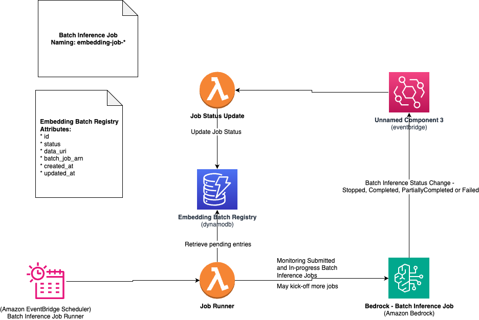

# Welcome to your CDK Python project!

## Prerequisites

To Create lambda layer, run the following command:

```
mkdir -p lambda-layer/python
cd lambda-layer/python
pip install boto3 -t .
cd ../..
```

## Architecture 

